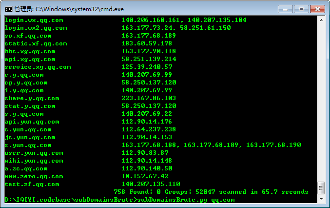

# subDomainsBrute 1.2 #

A fast sub domain brute tool for pentesters.

本工具用于渗透测试目标域名收集。高并发DNS暴力枚举，发现其他工具无法探测到的域名, 如Google，aizhan，fofa。

You can get older versions via [https://github.com/lijiejie/subDomainsBrute/releases](https://github.com/lijiejie/subDomainsBrute/releases)

## Change Log 

* [2019-05-19] 
  * Add wildcard test
  * Scan faster and more reliable, now can brute up to 3000 domains per second
* [2018-02-06] 
	* 添加多进程支持。 多进程 + 协程，提升扫描效率。 
	* 预处理了原字典中的占位符，提升扫描效率
* [2017-06-03] 
  * Bug fix: normal_lines remove deep copy issues, thanks @BlueIce
* [2017-05-04] 
  * 使用协程替代多线程； 使用优化级队列减小队列长度； 优化占位符支持

## Dependencies ##
> pip install dnspython gevent

## Usage ##
	Usage: subDomainsBrute.py [options] target.com
	Options:
	  --version             show program's version number and exit
	  -h, --help            show this help message and exit
	  -f FILE               File contains new line delimited subs, default is
	                        subnames.txt.
	  --full                Full scan, NAMES FILE subnames_full.txt will be used
	                        to brute
	  -i, --ignore-intranet
	                        Ignore domains pointed to private IPs
	  -t THREADS, --threads=THREADS
	                        Num of scan threads, 200 by default
	  -p PROCESS, --process=PROCESS
	                        Num of scan Process, 6 by default
	  -o OUTPUT, --output=OUTPUT
	                        Output file name. default is {target}.txt

## Screenshot ##

如图，使用大字典扫描 qq.com，发现去重后域名3693个，每秒可扫描3000个域名。

From [http://www.lijiejie.com](http://www.lijiejie.com)